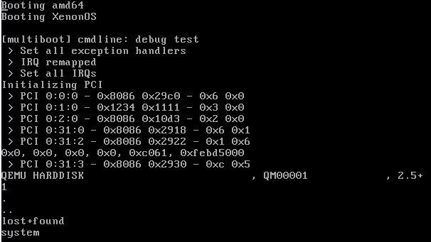

XenonOS
=======

Intro
-----
XenonOS is a hobbyist kernel project started during the quarantine. It's being written in C++17.


(identifying a AHCI SATA disk + listing ext2 dirs)

Build
-----
The first build will download and compile binutils and gcc to cross-compile the project.

```shell
% ./build.sh --build --debug --qemu
```

Debugging the code with GDB is simple:
```shell
% ./build.sh --build --debug --qemu --gdb
```

It will launch QEMU in debug mode and start GDB in a new terminal:

